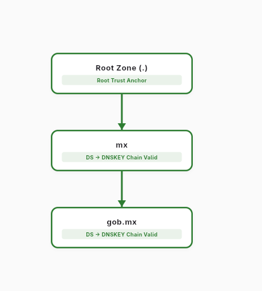

# Auditoría de Infraestructura y Validación DNSSEC

Este repositorio contiene los entregables correspondientes a la auditoría automatizada y análisis de seguridad sobre la implementación de **DNSSEC (Domain Name System Security Extensions)** en una muestra de 50 dominios críticos dentro de los sectores gubernamental, académico, financiero, comercio electrónico y medios de comunicación en México.

---

## 📁 Contenido del Repositorio

El proyecto se compone de los siguientes elementos principales necesarios para la validación técnica:

1. **`reporte_infraestructura_dnssec.csv`**: Base de datos con los resultados consolidados de la auditoría.
2. **`Tarea4.py`**: Script automatizado en Python encargado de la recolección de métricas DNS.
3. **Diagramas de Arquitectura**: Representaciones visuales de la cadena de confianza y jerarquía DNS.

---

## 📊 Matriz de Resultados (CSV/Excel)

Los datos fueron recolectados de forma estructurada analizando las siguientes variables por cada dominio de la muestra:

- **Dominio**: Nombre de la zona analizada.
- **DNSSEC activo (sí/no)**: Indica si el dominio expone registros `DNSKEY`.
- **valida (sí/no)**: Determina si la zona cuenta con una cadena de confianza íntegra verificable.
- **motivo de fallo si lo hay**: Diagnóstico del estado o inconsistencia criptográfica (ej. _Isla de confianza_, _Bogus_).
- **NSEC (NSEC/NSEC3/na)**: Mecanismo empleado para la negación autenticada de existencia.
- **algoritmo**: Identificador técnico del algoritmo criptográfico (ej. _RSASHA256_, _ECDSAP256SHA256_).
- **keysize bits**: Longitud de los pares de llaves detectados (KSK y ZSK).
- **RRset firmadas**: Confirmación de la presencia de firmas `RRSIG`.
- **DS en zona padre (sí/no)**: Evidencia del registro delegatorio en el TLD superior (ej. `.mx`).
- **observaciones adicionales**: Notas técnicas particulares sobre la resolución del host.

---

## 🗺️ Diagrama del Flujo de Validación DNSSEC

El siguiente diagrama ilustra el proceso de validación descendente (_Top-Down validation_) partiendo desde las llaves ancla de la raíz (`.`), pasando por los registros de delegación de los TLDs correspondientes (`.mx`, `.com.mx`), hasta llegar a la resolución final y verificación de las firmas del dominio objetivo.

El flujo enfatiza la interconexión crítica entre los registros **DS (Delegation Signer)** heredados por el padre y las llaves públicas **DNSKEY** de la zona hija.



El repositorio de la aplicación esta en este [vínculo](https://github.com/TheOnlyFakeCoder/dnstree)

## 🌲 Árbol DNS Jerárquico de Ejemplo

Representación de la infraestructura jerárquica del sistema de nombres de dominio enfocado en entornos firmados criptográficamente. Muestra cómo se hereda y construye la confianza de forma piramidal a través de las llaves del Root, las zonas de segundo nivel y los subdominios institucionales.

```text
Árbol para gob.mx:
└── .
    └── mx.
        └── gob.mx.
```

## ⚙️ Automatización (Script de Consulta)

La recolección se realiza mediante el script `Tarea4.py`, desarrollado sobre el entorno **Python 3**. Hace uso de la librería especializada `dnspython` para interactuar con servidores DNS autoritativos y resolver las consultas de registros de seguridad con los flags extendidos de EDNS (DNSSEC OK).

```

```
